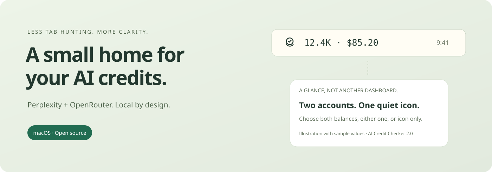
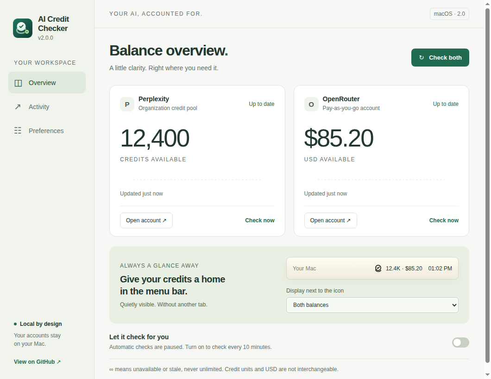

<div align="center">
  
  <h1>AI Credit Checker</h1>
  <p>Your AI credits. Quietly in your menu bar.</p>
  <p>
    <a href="https://github.com/paulfxyz/ai-credit-checker/releases/latest"></a>
    <a href="LICENSE"></a>
    
    
    <a href="https://github.com/paulfxyz/ai-credit-checker/actions/workflows/ci.yml"></a>
  </p>
  <p><a href="https://github.com/paulfxyz/ai-credit-checker/releases/latest">Download for Mac</a> · <a href="INSTALL.md">Install guide</a> · <a href="PRIVACY.md">Privacy</a> · <a href="CONTRIBUTING.md">Contribute</a></p>
  
</div>

## A small app for a surprisingly annoying problem

Your credit balance should not require a tour of billing pages. AI Credit Checker gives Perplexity organization credits and OpenRouter account dollars a quiet home on your Mac.

Sign in on the real provider websites inside the app. It reads the visible available-balance labels, stores timestamped observations locally and shows the result in your menu bar. No browser extension, companion server, Stream Deck plugin or AI inference is involved.



Screenshots and illustrations use synthetic sample data, not an account owner's real balance. The screenshots are captured from the running Electron app in the automated test environment; the menu-bar preview inside the window is a preview, not a screenshot of the native macOS menu bar.

## What you get

- **Numbers beside the icon:** Both balances, Perplexity only, OpenRouter only or icon only. Change the display from the dashboard or the native menu.
- **Exact values when you need them:** The dashboard shows the full credit count and USD amount. Compact menu-bar counts use one decimal and truncate rather than round upward.
- **Background checks:** Every ten minutes while the app is running and your Mac is awake. Account windows that remain visible are skipped so checks do not interrupt login.
- **Clear freshness:** A failed or at-least-20-minute-old reading becomes `∞`, meaning unavailable, never unlimited.
- **Local history:** Keep up to 2,000 check records, filter by provider and export JSON without cookies or passwords.
- **A proper Mac home:** Original app icon, monochrome template menu-bar icon, optional launch at login, and refresh after wake when background checks are enabled.

## Get started

1. Download **AI-Credit-Checker-2.0.0-macOS-arm64.zip** from [Releases](https://github.com/paulfxyz/ai-credit-checker/releases/latest).
2. Extract it and drag **AI Credit Checker.app** to Applications.
3. Open the app, use **Open account** to sign in to each provider, then click **Check now**.
4. Choose what to show beside the menu-bar icon. Close the account windows and enable automatic checks.

The 2.0.0 download is an **ad-hoc-signed community build, not Developer ID signed or notarized**. macOS may require an explicit approval in Privacy & Security. Do not disable Gatekeeper or remove enterprise controls; see the [installation guide](INSTALL.md).

## Two balances, two different units

| Provider | What is collected | What is not collected |
| --- | --- | --- |
| Perplexity | Available organization Computer credit pool from the signed-in Usage page | Personal-plan allowances, credits already used, refill amounts, or a USD estimate |
| OpenRouter | Available account balance in USD from the signed-in Credits page | A model token count or another organization's balance |

The collector targets [Perplexity organization Usage](https://www.perplexity.ai/account/org/credits-usage) and [OpenRouter Credits](https://openrouter.ai/settings/credits). Availability depends on your account role, the provider's website and successful login. An ordinary personal Perplexity account without organization-pool access is not covered by this implementation.

The current Perplexity parser recognizes the English labels **Available org credits**, **Available organization credits** and **Available organisation credits**. It deliberately refuses an ambiguous reading rather than guessing from another number on the page.

## How it works

```text
Provider website inside an isolated Chromium session
                         │
              Read the available-balance label
                         │
              Validate amount, unit and scope
                         │
             Local timestamped observations
                         │
         Dashboard + history + native menu bar
```

Each provider uses a separate persistent browser session. Remote pages have no Node access or privileged preload bridge; renderer sandboxing, context isolation and web security stay enabled. There is no undocumented API probing, browser-policy modification, cookie import from another browser, or automated verification bypass.

The app uses deterministic code, not an AI agent, to check and display balances. No AI model or inference API is called by the monitor.

## What to expect

- **Website collection is not an official balance API.** A provider can change its wording, markup or sign-in requirements and break extraction.
- **Login support varies.** Some SSO or verification flows may reject embedded browsers. We do not bypass those restrictions.
- **Closing the window is not quitting.** The app stays in the menu bar. Use Quit to stop it.
- **Sleeping is sleeping.** The app does not keep your Mac awake. On wake it attempts a refresh if background checks are enabled and the account window is not visible.
- **No silent auto-updater.** Download a new release and replace the app. Future notarization and easier distribution are possible improvements, not current features.
- **Apple Silicon release.** This release provides an arm64 binary. Intel binaries are not supplied or tested.

## From the original proof of concept

Version 2.0 is a fresh, desktop-only project built on the collector that the original user verified against both live services. The Stream Deck and Comet-extension experiments are not part of this repository.

On first launch, the app can automatically import numeric observation history from the original **Credit Monitor POC** data directory if it still exists. It does not copy browser cookies or passwords. Imported accounts are marked as requiring sign-in, not falsely shown as connected. See [migration instructions](INSTALL.md#moving-from-credit-monitor-poc).

## Develop and test

Requires Node.js 22.12 or later.

```sh
git clone https://github.com/paulfxyz/ai-credit-checker.git
cd ai-credit-checker
npm ci
npm start
```

```sh
npm test
npm run test:smoke
npm run package:mac
```

Release maintainers can use `bash scripts/package-release.sh` to produce an ad-hoc-signed archive and checksum. On macOS it uses the built-in `codesign`; cross-platform packaging requires `rcodesign` on PATH or an explicit `RCODESIGN` path. This is not a notarization workflow.

On Linux, run the Electron smoke test with `xvfb-run -a npm run test:smoke`. The test-only Linux launch uses `--no-sandbox` in the isolated test process; the packaged Mac app does not use that flag.

The tests cover supported label spellings, strict amount parsing, stale readings, menu-bar formatting, history migration, isolated sessions, restart persistence and the dashboard flows. They use synthetic pages. They do not substitute for real provider login or native menu-bar testing. See [validation notes](docs/VALIDATION.md).

## Open source, honestly

### Disclaimer: 100% vibe coding

Built by **Paul Fleury** with AI assistance. I am an entrepreneur building useful software with AI, not presenting this as the work of a traditional full-time software engineer.

The code is open so it can be inspected, challenged and improved. Tests and explicit limitations matter more than claims of perfection. Treat this as a community utility, not an authoritative billing ledger.

AI Credit Checker is an independent project, not affiliated with or endorsed by Perplexity, OpenRouter, Apple or Electron. Provider names identify the accounts supported by the tool; the app and menu-bar artwork is original.

## License

MIT. The source code and original artwork in this repository are covered by [LICENSE](LICENSE). Bundled dependencies retain their own licenses.
